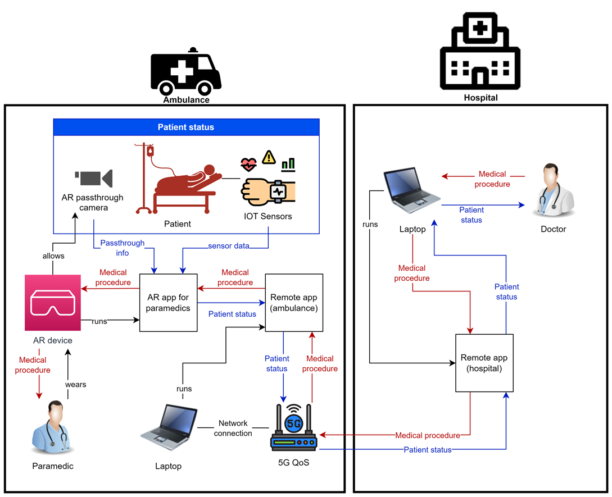
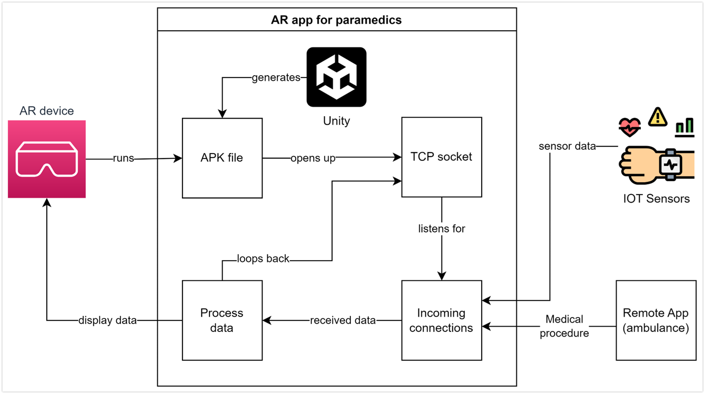
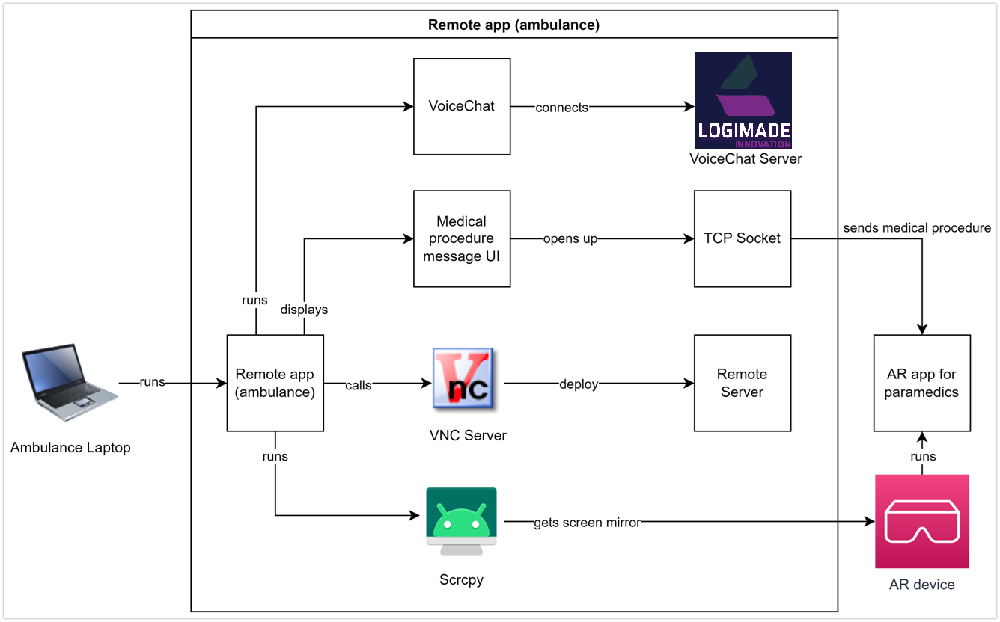
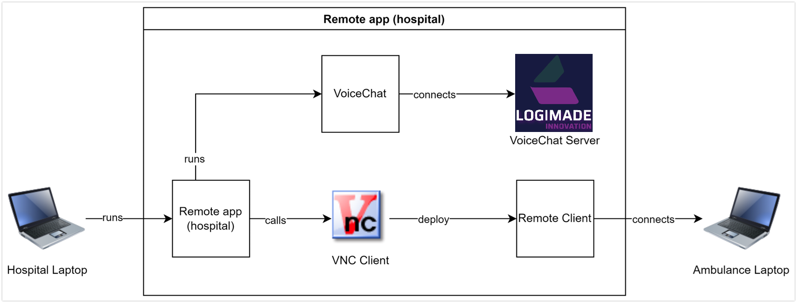

# Road to Recovery

Road to Recovery is a project designed to facilitate seamless video and audio transmission between a Medic located at a hospital and a Paramedic in an ambulance. The Paramedic wears a VR headset with passthrough enabled, which is mirrored onto a laptop using `scrcpy` and then transmitted over VNC to the Medic. This allows the Medic to see the live feed and guide the Paramedic through necessary medical procedures.

## System Architecture
The following diagram represents the system architecture followed throughout the project:

## Main Modules
The following diagrams represents the main modules that were used by the system:
- **AR app** 
  - The AR app manages all data associated with the VR glasses and is developed using Unity software. Acting as a server, it utilizes TCP sockets for communication. These sockets transmit information about the patient's status, including temperature, blood pressure, and oxygen levels. They also convey the medical procedures that paramedics need to follow. This data is then presented as a Head-Up Display (HUD) on the VR goggles.
The VR goggles used for this project are the Meta Quest Pro.

- **Remote app (Ambulance)** 
  - The Remote App (Ambulance) serves as the primary server for most components, handling data transmission to the AR device and facilitating two-way communication with the hospital. Developed in C, it incorporates a VNC server as the core component for communications between the ambulance and the hospital. Additionally, the app features a UDP Voice Chat, hosted on Logimade servers, which is designed to be resilient to errors and connection issues. The Remote App (Ambulance) serves as the primary server for most components, handling data transmission to the AR device and facilitating two-way communication with the hospital. Developed in C, it incorporates a VNC server as the core component for communications between the ambulance and the hospital. Additionally, the app features a UDP Voice Chat, hosted on Logimade servers, which is designed to be resilient to errors and connection issues. To display passthrough information on the laptop, the scrcpy software is utilized. Due to Meta's strict policies on sharing this type of information, we use this mirroring software to securely access the data.

- **Remote app (Hospital)** 
  - The Remote App (Hospital) acts as the client in the system, enabling the doctor to monitor the patient's status and the overall situation in the ambulance. Also developed in C, it incorporates a VNC client as the main component for connecting to the ambulance. Additionally, this application connects to the Voice Chat server on the Logimade host using UDP transmission. 

## Features

- **Real-time Video and Audio Transmission:** Live video feed from the Paramedic’s VR headset to the Medic.
- **VR Headset Passthrough:** Allows the Paramedic to see their surroundings while transmitting the view.
- **scrcpy Integration:** Mirrors the VR headset feed onto a laptop.
- **VNC Transmission:** Transmits the mirrored feed from the laptop to the Medic's client.
- **Two-way Communication:** Enables the Medic to provide real-time instructions to the Paramedic.

## System Requirements

### Paramedic Side (Ambulance)
- VR Headset with Passthrough capability
- Android Device
- Laptop with:
  - Windows

### Medic Side (Hospital)
- Computer with:
  - Windows

## Installation

### Paramedic Side

1. **Clone the repository**:
    - The main components needed are:
        - VNC Server App
        - scrcpy
        - VoiceChat
        - start SERVER.bat

### Medic Side (Hospital)

1. **Clone the repository**:
    - The main components needed are:
        - VNC Client App
        - VoiceChat
        - start CLIENT.bat

## Usage

1. **Medic**:
   - Run the 'start CLIENT.bat' file.

2. **Paramedic**:
   - Run the 'start SERVER.bat' file.

## Troubleshooting

- **No Video Feed**: Ensure the VR headset is properly connected and passthrough mode is enabled. Check the USB connection between the Android device and the laptop.
- **VNC Connection Issues**: Verify that the VNC server is running on the Paramedic's laptop and that the network settings allow for VNC connections.
- **Audio Problems**: Ensure that the audio settings on both ends are configured correctly and that the necessary permissions are granted for audio transmission.

## Contributing

We welcome contributions to enhance the functionality and reliability of Road to Recovery. Please fork the repository and create a pull request with your improvements.

## License

This project is licensed under the MIT License. See the [LICENSE](LICENSE) file for details.

## Acknowledgements

- Thanks to the developers of `scrcpy` for providing a powerful and flexible screen mirroring solution.
- Thanks to the VNC community for their robust and reliable remote desktop solutions.

## Contact

For any questions or feedback, please contact us at [tiago.ribeiro@logimade.com].

